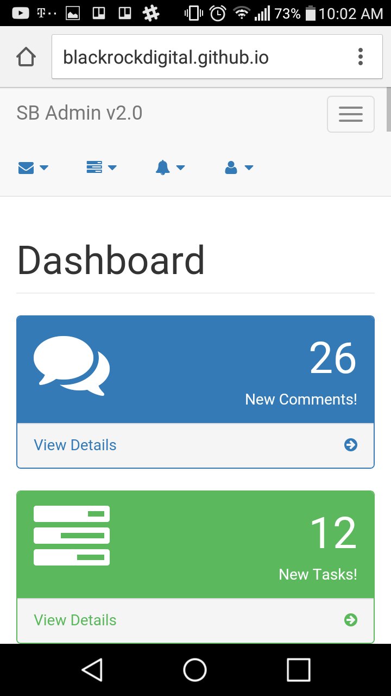

# PrayerHub

The purpose of PrayerHub is to connect people together through the power of prayer and meditation.  PrayerHub will be designed to host a list of causes for users to pray for.  When a person selects a cause they would like to pray or meditate on, they will be asked to select a date and time to pray for a specific cause.  If a person so wishes, they can even add a new cause for others to pray for.  One possible way of keeping things manageable with user generated prayer requests is to have only users who have prayed for others eligible to make requests.

##ERD

##Wireframes

Wireframe and ERD images are included in the Trello board.
The link to which is bellow.

<a href="https://trello.com/b/z0iWNf3j/prayer-hub">My Trello</a>