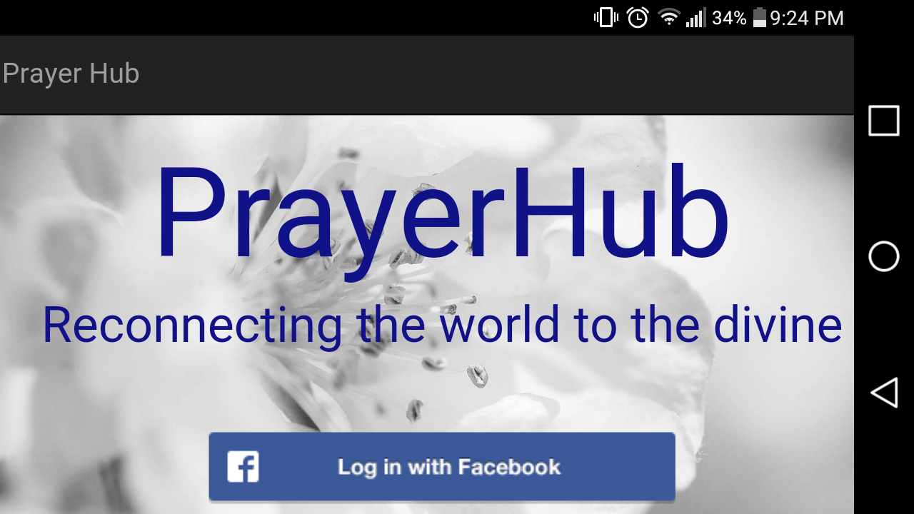

# PrayerHub

<a href="https://prayer-hub.herokuapp.com">PrayerHub</a>
 
<a href="https://trello.com/b/z0iWNf3j/prayer-hub">My Trello</a>
##Purpose
The purpose of Prayer Hub is to connect people for the purposes of being a blessing to everyone. When a new user first logs in, they are met with causes that to pledge time for. He or she can click on the title or content of the cause, and be directed to a page where they can pledge a certain amount of time on a certain day to pray or send positive thoughts to someone else in need.

##Technologies Used
+ MEAN Stack 
+ + Mongoose
+ + Express Generator
+ + + express-session
+ + + body-parser
+ + + ejs
+ + + cookie-parser
+ + + morgan
+ + AngularJs
+ + NodeJs
+ JWTS
+ OAUTH2 (Via Passport and Passport Facebook)
+ Twitter Bootstrap (CSS Only)
+ HTML5
+ CSS
+ JavaScript

##Installation Instructions
+ Fork the repo
+ Clone the repo
+ Run npm install
+ Start your server

##ERD

##Wireframes

